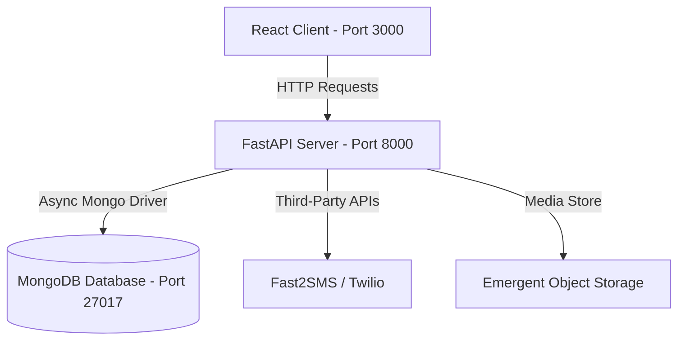

# 🛠️ Sabewell Support - Customer Complaint Tracker

[](https://fastapi.tiangolo.com/)
[](https://react.dev/)
[](https://www.mongodb.com/)
[](https://tailwindcss.com/)
[](https://www.radix-ui.com/)

An enterprise-grade, high-contrast, Swiss-inspired **Customer Support & Complaint Tracking System** designed for **Sabewell**. This application features a robust FastAPI backend connected to MongoDB, partnered with a modern React frontend styled according to strict design rules (Outfit & IBM Plex Sans typography, flat high-contrast cards, and solid Lucide icons).

---

## 🌟 Key Features

* **📦 Complaint Management (CRUD):** Complete suite to register, update, and resolve support tickets.
* **👥 Automatic Customer Profiling:** Dynamically groups complaints by normalized E.164 phone numbers and synthesizes customer files.
* **🔔 Multi-Channel Notifications:**
  * **SMS Alerting:** Primary alerting via **Fast2SMS** (Indian numbers) with instant fallback to **Twilio**.
  * **WhatsApp Integration:** Direct templates dispatched via Fast2SMS and Twilio for instant tracking updates.
* **🌐 Secure Public Tracking Page:** Customers can trace complaint status, view timelines, and upload/view photos securely without authentication (sensitive information is masked/redacted).
* **📸 Proof of Defect Photos:** Secure upload of up to 5 photos per complaint, stored in an object storage container.
* **📈 Executive Analytics:** Live dashboard with status counts (Pending, In Progress, Resolved) and advanced search capabilities.

---

## 🏗️ Architecture & Technology Stack



### Backend
* **FastAPI:** High-performance, modern, and asynchronous web framework for building APIs with Python.
* **MongoDB & Motor:** Document database with an asynchronous Python driver.
* **Pydantic v2:** Fast, robust data validation and serialization.
* **JWT Authentication:** Secure admin session management.

### Frontend
* **React 19 & React Router v7:** Modern component-driven application structure.
* **Tailwind CSS:** Utility-first styling utilizing a custom Swiss, flat-bordered aesthetic.
* **Radix UI & Lucide Icons:** High-contrast, clean, and accessible UI controls.

---

## 📋 System Prerequisites

Before running the application, please verify that you have the following installed on your host system:

1. **Python 3.10+** (System is currently running `Python 3.13.5`)
2. **Node.js 18+** (System is currently running `Node v24.3.0`)
3. **MongoDB Server** (Running locally on `localhost:27017`)
4. **Git** (for version control)

---

## 🚀 Step-by-Step Installation & Setup

### 1. Database Setup
Ensure that your MongoDB instance is running locally on port `27017`.
If you are running MongoDB as a service on Windows:
```powershell
# Verify MongoDB service status in PowerShell
Get-Service -Name MongoDB
```

---

### 2. Backend Configuration
Navigate to the `/backend` folder:
```bash
cd backend
```

#### A. Set up Environment Variables (`.env`)
Create/edit the `.env` file inside the `backend` directory. Fill in your API credentials:
```env
MONGO_URL=mongodb://localhost:27017
DB_NAME=test_database
CORS_ORIGINS=http://localhost:3000
JWT_SECRET=your-secret-key
JWT_ALGORITHM=HS256

# Seed Credentials (Auto-created on server start)
ADMIN_EMAIL=admin@company.com
ADMIN_PASSWORD=Admin@123
BRAND_NAME=sabewell
PUBLIC_APP_URL=http://localhost:3000

# Optional Notification APIs
FAST2SMS_API_KEY=your_fast2sms_api_key
FAST2SMS_WHATSAPP_MESSAGE_ID=your_whatsapp_template_id
TWILIO_ACCOUNT_SID=your_twilio_sid
TWILIO_AUTH_TOKEN=your_twilio_auth_token
TWILIO_WHATSAPP_FROM=whatsapp:+14155238886
TWILIO_SMS_FROM=+1234567890

# Optional Object Storage
EMERGENT_LLM_KEY=your_emergent_key
APP_NAME=sabewell
```

#### B. Setup Virtual Environment & Install Dependencies
Activate the virtual environment (we recommend the pre-configured `.venv` directory):
```powershell
# Create venv if not present
python -m venv .venv

# Activate Virtual Environment (PowerShell)
.\.venv\Scripts\Activate.ps1

# Install requirements
pip install -r requirements.txt
```

#### C. Run the Backend Server
Start the FastAPI server via Uvicorn:
```powershell
python -m uvicorn server:app --host 127.0.0.1 --port 8000 --reload
```
* **Interactive Documentation:** Visit [http://127.0.0.1:8000/docs](http://127.0.0.1:8000/docs) to access Swagger UI.
* **Service Status:** [http://127.0.0.1:8000/api/](http://127.0.0.1:8000/api/) should return:
  `{"service": "sabewell complaint tracker", "status": "ok"}`

---

### 3. Frontend Configuration
Navigate to the `/frontend` folder:
```bash
cd ../frontend
```

#### A. Set up Environment Variables (`.env`)
Create/edit the `.env` file in the `frontend` folder:
```env
REACT_APP_BACKEND_URL=http://localhost:8000
```

#### B. Install Node Modules
Since `yarn` is not globally installed, run the installation script using `npm`:
```powershell
npm install
```

#### C. Start the React Application
Start the development server:
```powershell
npm start
```
* The portal will open automatically at [http://localhost:3000](http://localhost:3000).

---

## 🔑 Default Credentials

To log into the Admin Control Panel, use the default seeded credentials:
* **Admin Email:** `admin@company.com`
* **Password:** `Admin@123`

---

## 📡 API Reference Overview

| Endpoint | Method | Authentication | Description |
| :--- | :--- | :--- | :--- |
| `/api/` | `GET` | None | Base service health check |
| `/api/auth/login` | `POST` | None | Authenticate admin, returns JWT token |
| `/api/auth/me` | `GET` | Admin JWT | Verify credentials and token validity |
| `/api/complaints` | `POST` | Admin JWT | Register a new customer complaint |
| `/api/complaints` | `GET` | Admin JWT | List all complaints (with status/search query filters) |
| `/api/complaints/{cid}` | `GET` | Admin JWT | Get full details of a specific complaint |
| `/api/complaints/{cid}/status`| `PATCH` | Admin JWT | Update complaint status and send SMS/WhatsApp alert |
| `/api/complaints/{cid}/warranty`|`PATCH`| Admin JWT | Toggle warranty status (Warranted/Unwarranted) |
| `/api/complaints/{cid}/photos`| `POST` | Admin JWT | Upload defect photo (Max 5 files, 5MB, JPG/PNG/WebP) |
| `/api/track/{cid}` | `GET` | None | Public status tracking page for customers (masked details) |

---

## 🛠️ Troubleshooting

### Port Conflicts
* **Port 8000 is occupied:** Change the port using `--port <port_number>` in the uvicorn launch command, and match this inside the frontend `.env`.
* **Port 3000 is occupied:** Run `npm start` and choose `Y` to automatically start on another available port (like `3001`).

### Database Issues
* If you receive a connection error at startup, make sure MongoDB is running locally on port 27017:
  ```powershell
  Test-NetConnection -ComputerName localhost -Port 27017
  ```
